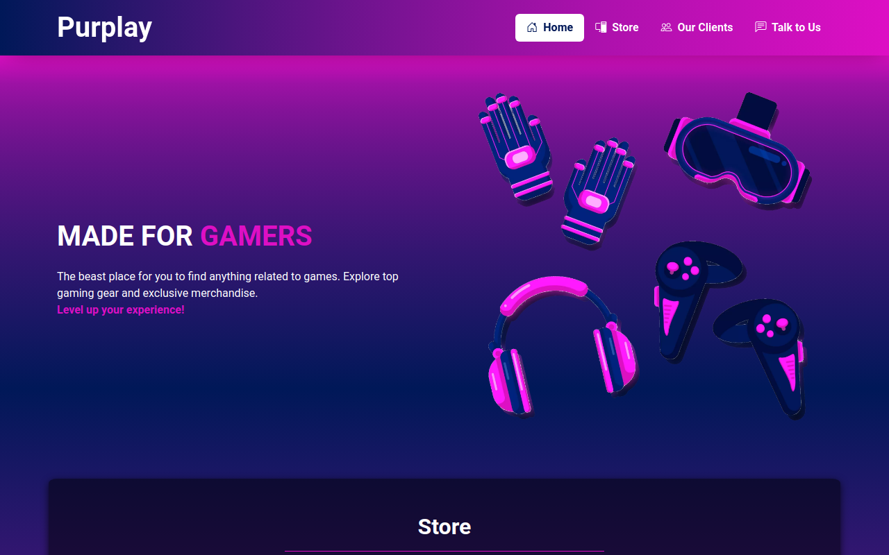

  

<h1 align="center">Purplay - Gaming Store (Projeto nº 3)</h1>

<h2>👩🏻‍💻 Projeto</h2>

   Projeto realizado como exercício do módulo 14 do curso Full-Stack Python da EBAC - Escola Britânica de Artes Criativas e Tecnologia.

 

<h2>🎯 Objetivo</h2>

  Este projeto consiste na construção de uma landing page utilizando os conteudos aprendidos durante o módulo, onde foi aperfeiçoado os conhecimentos de bootstrap.

 

<h2>💻 Linguagens & Ferramentas</h2>

* HTML5
* CSS3
* Bootstrap
* Git
* VSCode
 

## Link do deploy: <https://purplaygamingstore.vercel.app/>
